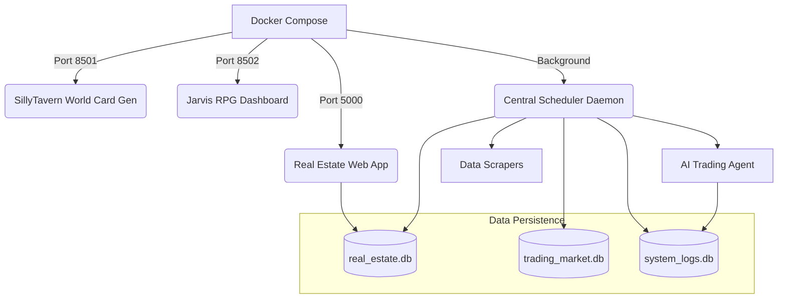
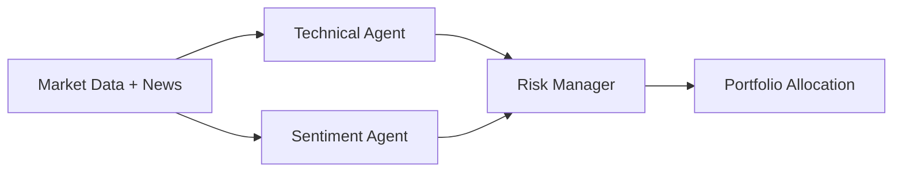

# 🏗️ System Architecture: LangGraph Agent System

This document outlines the architectural decisions and design patterns used in the **LangGraph Agent System**, transforming it from a local script-based utility into a production-ready, Dockerized monorepo.

---

## 1. High-Level Architecture (Monorepo)

The system is built as a **Monorepo** containing multiple distinct sub-projects managed through a centralized Docker orchestration layer.

## 2. Core Framework: LangGraph Multi-Agent System

At the heart of the project is a customized **4-Agent Workflow** using `langgraph` designed to ensure code quality, logical execution, and self-healing mechanisms.

### 4-Agent Pipeline
1. **Planner Node (`gemini-2.5-flash`)**: Analyzes the raw request and outputs a step-by-step strategy.
2. **Architect Node (`gemini-2.5-flash`)**: Takes the strategy and designs the technical components, system architecture, and module structure.
3. **Worker Node (`gemini-2.5-flash`)**: Translates the architecture into actual Python code and executes it in an isolated environment. Captures execution logs and stack traces.
4. **Reviewer Node (`gemini-3.1-pro-preview`)**: The "Quality Control". Analyzes the Worker's output, checks against the initial request, and either approves (`OK`) or sends feedback back to the Architect/Worker.

### Circuit Breaker Mechanism
To prevent infinite loops and token exhaustion, a `revision_count` is maintained in the LangGraph `AgentState`. If `revision_count > 3`, the circuit breaker trips, halting the graph and requesting human intervention.

## 3. Sub-Project Architectures

### 📈 AI Trading Agent (3-Agent System)
Designed to analyze markets and execute trades on Binance Testnet/Live.

- **Technical Agent**: Calculates RSI, SMA, and analyzes OHLCV data.
- **Sentiment Agent**: Scrapes CoinTelegraph via RSS to detect bullish/bearish news. Contains a special **Whale Alert** rule.
- **Risk Manager**: Aggregates inputs. If a "Whale" is detected, it overrides standard logic to increase confidence scores (`9/10`), executing aggressive strategic trades.

### 🏠 Real Estate Prediction Pipeline
An End-to-End Data Science pipeline using Python, XGBoost, and Flask.

1. **Scraping**: `Playwright` with anti-Cloudflare mechanisms (random scrolling, human pauses). Data is dumped into `real_estate.db`.
2. **Data Cleaning**: Uses **Local Z-Score Filtering** instead of global Z-Score to prevent deleting high-value properties in central districts.
3. **Feature Engineering**: Uses Regex to parse unstructured text in property titles (e.g., extracting "mặt tiền", "hẻm", "sổ hồng") and converts them into boolean variables.
4. **Modeling**: A **Segmentation Logic** approach. The data is split into `High_End` and `Mass_Market`. Two separate XGBoost models are trained with Hyperparameter tuning via `RandomizedSearchCV` and `K-Fold Cross Validation` to combat overfitting.
5. **Deployment**: Served via a Flask Web App integrating Folium maps for heatmaps.

## 4. DevOps & Production Deployment

The project has transitioned from a local execution model (`dashboard.py`) to a scalable Cloud architecture.

- **Dockerization**: A single `Dockerfile` uses a multi-stage approach. It leverages `find` commands to dynamically locate and install all `requirements.txt` from all sub-projects, maintaining a DRY (Don't Repeat Yourself) Dockerfile.
- **Docker Compose**: Orchestrates the Flask app, Streamlit apps, and background scheduler into isolated but networked containers.
- **CI/CD**: GitHub Actions workflows are configured to automatically lint Python code (catching syntax errors) and test the Docker build process on every push to `main`.
- **Reverse Proxy**: Nginx is configured to handle traffic routing to different ports (`5000`, `8501`, `8502`) and manage SSL termination (HTTPS) via Let's Encrypt / Certbot.