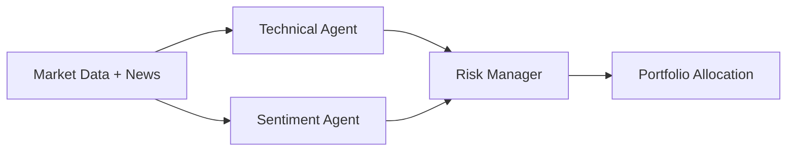
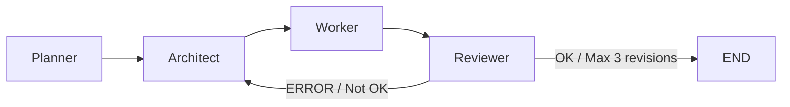

# 📋 CONTEXT SUMMARY - LangGraph_Agent_System

> **Last Updated:** 2026-03-13  
> **Purpose:** Tóm tắt nhanh context project cho AI Assistant. 
> 
> 🚨 **AI CHÚ Ý:** Nếu bạn vừa bắt đầu phiên chat mới, hãy đọc ngay file **`AI_ONBOARDING_GUIDE.md`** ở thư mục gốc để biết cách tiếp cận các dự án con (sub-projects) một cách chính xác nhất!

---

## 🎯 OVERVIEW

**LangGraph_Agent_System** là một hệ thống tích hợp 3 dự án chính sử dụng Multi-Agent Architecture với LangGraph:

### 📦 5 Dự án chính:
1. **AI Trading Agent** - Bot giao dịch crypto đa tài sản (BTC, ETH, SOL) với 3-agent system
2. **Bất động sản Prediction** - Mô hình dự báo giá BĐS Đồng Nai (XGBoost + Flask Web App)
3. **Airdrop Guerrilla** - Bot tự động hóa crypto & cày airdrop (Twitter, Discord, Zealy)
4. **SillyTavern World Card Generator** - Công cụ AI tự động tạo thẻ thế giới (World Card) cho SillyTavern V3 bằng Streamlit
5. **Jarvis RPG Assistant** - Trợ lý ảo cá nhân game hóa (CI/CD, Docker, Gemini, Microservices)

### 🧠 Kiến trúc Multi-Agent:
- **LangGraph** - Framework quản lý luồng agent
- **4-Agent Workflow** - Planner → Architect → Worker → Reviewer (có Circuit Breaker)
- **Sequential Thinking MCP** - Tool suy luận step-by-step

---

## 🏗️ CẤU TRÚC THƯ MỤC

```
LangGraph_Agent_System/
├── dashboard.py                      # ⭐ MENU TRUNG TÂM (Chạy file này!)
├── CONTEXT_SUMMARY.md                # 📄 FILE NÀY (Đang đọc)
├── .env                            # 🔐 Keys: API, Telegram, Database
├── auto_scrape_scheduler.py           # 🕷️ Cronjob cào BĐS mỗi 30p
├── auto_trading_scheduler.py          # ⏰ Cronjob trading
├── run_live_trading_now.bat          # 🚀 Batch file chạy trading thủ công
│
├── src/                            # 🧠 KHỐI NÃO (LangGraph Core)
│   ├── graph.py                     # Workflow: Planner→Architect→Worker→Reviewer
│   ├── state.py                     # State definition cho agent system
│   ├── Node.py                     # 4 nodes: planner, architect, worker, reviewer
│   └── database.py                  # SystemDB: log trading, updates, paper trade
│
├── projects/                       # 🦶 KHỐI TAY CHÂN (3 dự án)
│   ├── ai_trading_agent/            # 📈 Dự án 3: AI Trading
│   │   ├── langgraph_agent.py       # ⭐ 3-Agent: Technical, Sentiment, Risk Manager
│   │   ├── live_advisor.py          # ⭐ Live advisor (chạy báo lệnh hôm nay)
│   │   ├── binance_executor.py      # ⭐ Executor (Paper/Live Testnet)
│   │   ├── data_fetcher.py         # Pull data đa tài sản + indicators
│   │   ├── news_scraper.py         # Scraping RSS Feed CoinTelegraph
│   │   └── backtester.py          # Mô phỏng backtest
│   │
│   ├── real_estate_prediction/       # 🏠 Dự án 2: BĐS Prediction
│   │   ├── app.py                 # Flask Web App + Bản đồ
│   │   ├── train_model.py           # XGBoost model + Feature Engineering
│   │   └── generate_word_report.py  # Tạo báo cáo Tiểu luận auto
│   │
│   ├── airdrop_guerrilla/          # 🎁 Dự án 1: Airdrop Guerrilla
│   │   ├── src/automation/
│   │   │   ├── wallet_manager.py    # Mã hóa keys, chống Sybil
│   │   │   ├── executor.py         # Bot Twitter/Discord
│   │   │   └── zealy_bot.py       # Bot cày Zealy
│   │   └── src/scrapers/
│   │       └── defillama_funding_parser.py
│   │
│   └── universal_web_scraper/      # 🕷️ Generic Scraper
│       └── src/
│           ├── batdongsan_playwright.py  # ⭐ Playwright scraper BĐS (Stealth)
│           └── alonhadat_playwright.py
│   ├── jarvis-rpg-assistant/       # 🦸‍♂️ Dự án 5: Trợ lý ảo Jarvis (CI/CD, Docker)
│   │   ├── main.py
│   │   ├── jarvis_core/
│   │   ├── src/
│   │   └── tools/dashboard.py
│   ├── sillytavern_world_card_generator/ # 🃏 Dự án 4: Tạo Thẻ Thế Giới SillyTavern
│   │   ├── src/
│   │   │   ├── models/world_card_v3.py      # Cấu trúc JSON chuẩn SillyTavern V3
│   │   │   ├── agents/storyteller_agent.py  # Agent viết System Prompt
│   │   │   ├── agents/lore_master_agent.py  # Agent viết Lorebook
│   │   │   └── agents/coder_agent.py        # Agent viết Regex/UI
│   │   ├── data/templates/                  # Kho lưu trữ thẻ mẫu (Regex, Lorebook...)
│   │   └── ui/app.py                        # Giao diện web Streamlit
│
├── data/                           # 💾 DATABASE LAYER
│   ├── system_logs.db               # Trading decisions, backtests, paper trade, updates
│   ├── trading_market.db            # BTC/ETH/SOL OHLCV + indicators
│   └── real_estate.db             # BĐS scraped data
│
├── mcp_servers/                   # 🤖 MCP SERVERS (Cấu hình sẵn)
│   ├── executeautomation-mcp-playwright/  # ✅ Đã cấu hình (ĐANG HOẠT ĐỘNG)
│   └── sequentialthinking-mcp-server/    # ✅ Đã cấu hình (cần reload VS Code)
│
└── LATEST_REPORT.md                # 📊 Báo cáo tự động từ Dashboard (Phím 9)
```

---

## 🔑 FILE QUAN TRỌNG & LIÊN KẾT NHANH

| File | Chức năng | Link |
|------|-----------|------|
| **dashboard.py** | ⭐ **MỞ TRƯỚC** - Menu tổng hợp tất cả | `python dashboard.py` |
| **langgraph_agent.py** | 🧠 3-Agent AI Trading System (Tech+News+Risk) | `projects/ai_trading_agent/langgraph_agent.py` |
| **live_advisor.py** | 🤖 Báo lệnh hôm nay (Live Advisor) | `projects/ai_trading_agent/live_advisor.py` |
| **binance_executor.py** | ⚡ Executor (Paper/Live Testnet) | `projects/ai_trading_agent/binance_executor.py` |
| **data_fetcher.py** | 📊 Kéo data + tính indicators | `projects/ai_trading_agent/data_fetcher.py` |
| **graph.py** | 🔗 LangGraph Workflow (Planner→Architect→Worker→Reviewer) | `src/graph.py` |
| **state.py** | 📦 State definition cho Multi-Agent | `src/state.py` |
| **database.py** | 💾 SystemDB (SQL logging) | `src/database.py` |
| **batdongsan_playwright.py** | 🕷️ Playwright scraper BĐS (Stealth + Anti-Cloudflare) | `projects/universal_web_scraper/src/batdongsan_playwright.py` |
| **app.py (SillyTavern)** | 🃏 Web App tạo World Card bằng AI | `projects/sillytavern_world_card_generator/ui/app.py` |

---

## 🚀 CÁCH CHẠY DỰ ÁN

### ⭐ CÁCH NHANH NHẤT:
```bash
python dashboard.py
```
Sau đó chọn số (1-11) tương ứng với chức năng.

### 📌 Menu Dashboard:
```
[DỰ ÁN 2: BẤT ĐỘNG SẢN]
  1. 🏠 Chạy Web Dự báo BĐS & Bản đồ (Flask)
  2. 🕷️ Khởi động Bot cào dữ liệu BĐS ngầm (Scheduler)
  3. 🧠 Huấn luyện lại AI Mô hình BĐS (XGBoost)

[DỰ ÁN 3: AI TRADING AGENT]
  4. 🤖 Chạy AI Trading Live Advisor (Báo lệnh hôm nay)
  5. 📈 Chạy Backtest Mô phỏng AI Trading
  6. 🔄 Cập nhật Dữ liệu Giá & Tin tức mới nhất

[DỰ ÁN 1: AIRDROP GUERRILLA]
  7. 🎁 Chạy Bot cày Airdrop Zealy
  8. 🐦 Chạy Bot cày Twitter/Discord (Executor)

[DỰ ÁN 4: SILLYTAVERN WORLD CARD GENERATOR]
  9. 🃏 Chạy Web App Tạo World Card (Streamlit)

[QUẢN TRỊ HỆ THỐNG]
  9. 📊 Xuất Báo cáo Lịch sử Trading (Từ SQLite)
 10. 📝 Ghi Log Tiến độ Cập nhật (System Update Log)
 11. 💳 Kiểm tra số dư Binance Testnet (Live)

[0] ❌ Thoát
```

### 🔧 Chạy riêng lẻ:
```bash
# AI Trading
cd projects/ai_trading_agent
python live_advisor.py
python data_fetcher.py
python backtester.py

# BĐS
cd projects/real_estate_prediction
python app.py
python train_model.py

# Airdrop
cd projects/airdrop_guerrilla/src/automation
python zealy_bot.py
python executor.py
```

---

## 💾 DATABASE

### 1. **system_logs.db** (quan trọng nhất)
- **Bảng:** `Trading_Decisions` - Log quyết định AI Trading
- **Bảng:** `Backtest_Results` - Kết quả backtest
- **Bảng:** `Paper_Trade_Portfolio` - Số dư Paper Trading ($83,838.69)
- **Bảng:** `System_Updates` - Changelog cập nhật hệ thống
- **Truy cập:** `dashboard.py` → Phím 9

### 2. **trading_market.db**
- **Bảng:** `BTC_USD`, `ETH_USD`, `SOL_USD`
- **Cột:** Date, Open, High, Low, Close, Volume, SMA_20, SMA_50, RSI_14, FNG_Value, FNG_Class
- **Cập nhật:** `python data_fetcher.py`

### 3. **real_estate.db**
- **Bảng:** `Properties` - Dữ liệu BĐS đã cào
- **Cột:** Title, Price_VND, Area_m2, District, Province
- **Cập nhật:** `python batdongsan_playwright.py`

---

## 🤖 AI TRADING AGENT DETAIL

### 🧠 3-Agent Architecture:



#### 1. **Technical Agent** (`langgraph_agent.py` → `_technical_node`)
- **Model:** Gemini 2.5 Flash
- **Input:** Market data (BTC, ETH, SOL OHLCV + RSI, SMA, Fear & Greed)
- **Output:** Đánh giá xu hướng, quá mua/quá bán, sức mạnh trend
- **Task:** Phân tích kỹ thuật thuần túy

#### 2. **Sentiment Agent** (`langgraph_agent.py` → `_sentiment_node`)
- **Model:** Gemini 2.5 Flash
- **Input:** News from `news_scraper.py` (CoinTelegraph RSS Feed)
- **Output:** Tâm lý thị trường (Bullish/Bearish/Neutral), nhóm coin hưởng lợi
- **🐳 Whale Alert:** Phát hiện "Cá voi" nạp/rút lớn → In đậm `[CẢNH BÁO WHALE]`

#### 3. **Risk Manager** (`langgraph_agent.py` → `_risk_manager_node`)
- **Model:** Gemini 3.1 Pro (Model xịn để chốt sổ)
- **Input:** Tech Analysis + Sentiment Analysis + Current Portfolio
- **Output:** JSON allocation + confidence_score (1-10)
- **🐳 Whale Rule:** Nếu có `[CẢNH BÁO WHALE]` → Confidence Score = **9/10** (để aprove lệnh mạnh)

### 📊 Portfolio Allocation Format:
```json
{
    "reasoning": "Giải thích tư duy phân bổ vốn...",
    "allocation": {
        "BTC": 0.4,
        "ETH": 0.2,
        "SOL": 0.1,
        "USDT": 0.3
    },
    "confidence_score": 8
}
```

### ⚡ Execution Flow:
1. `data_fetcher.py` → Kéo data + tính indicators → Lưu vào `trading_market.db`
2. `news_scraper.py` → Cào RSS Feed → Trả về list news
3. `live_advisor.py` → Đọc data + news → Chạy 3-agent → Nhận allocation
4. `binance_executor.py` → Thực thi lệnh (Paper hoặc Live Testnet)
5. Log vào `system_logs.db`

### 🛡️ Mode Trading:
- **Paper Trading (Default):** Không cần API Key, dùng số dư ảo
- **Live Testnet:** Cần `BINANCE_TESTNET_API_KEY` và `SECRET` trong `.env`
- **Telegram Alert:** Auto send báo cáo khi có lệnh (nếu có `TELE_TOKEN` và `CHAT_ID`)

---

## 🧠 LANGGRAPH WORKFLOW (Core System)

### 🔄 4-Agent Flow:



#### **1. Planner Node** (`src/Node.py` → `planner_node`)
- **Task:** Tạo kế hoạch tổng thể
- **Model:** Gemini 2.5 Flash

#### **2. Architect Node** (`src/Node.py` → `architect_node`)
- **Task:** Thiết kế kỹ thuật chi tiết
- **Model:** Gemini 2.5 Flash

#### **3. Worker Node** (`src/Node.py` → `worker_node`)
- **Task:** Viết code Python thực tế
- **Model:** Gemini 2.5 Flash
- **Execute:** Chạy code và log kết quả/error

#### **4. Reviewer Node** (`src/Node.py` → `reviewer_node`)
- **Task:** Review code, kiểm tra lỗi
- **Model:** Gemini 3.1 Pro
- **Output:** "OK" hoặc feedback để sửa

#### **⚡ Circuit Breaker:**
- **Max 3 revisions** → Nếu Reviewer chưa hài lòng sau 3 lần → Dừng để con người can thiệp
- **Mục đích:** Tránh tràn token, lặp vô tận

### 📦 AgentState (`src/state.py`):
```python
{
    "task": str,              # Yêu cầu gốc
    "csv_info": str,          # Cấu trúc file data
    "plan": str,              # Kế hoạch từ Planner
    "architecture": str,      # Thiết kế từ Architect
    "draft": str,             # Code từ Worker
    "execution_log": str,      # Kết quả chạy code
    "review_feedback": str,    # Feedback từ Reviewer
    "revision_count": int,     # Số lần sửa (max 3)
    "error_log_path": str,    # Đường dẫn error_log.md
    "summary_history": str     # Tóm tắt lịch sử lỗi
}
```

---

## 🏠 BẤT ĐỘNG SẢN PREDICTION

### 🧠 Mô hình: XGBoost Regressor
- **Input:** Title, Price_VND, Area_m2, District
- **Feature Engineering:** Regex trích xuất từ Title
  - "nhà nát", "hxg" → Lower price
  - "mới", "đẹp", "sang" → Higher price
- **Output:** Dự báo giá BĐS

### 🕷️ Scraping: Playwright (Stealth)
- **File:** `batdongsan_playwright.py`
- **Anti-Cloudflare:** Random scroll, human pause, guerrilla mode
- **Strategy:** Mỗi batch chỉ cào 2 trang → nghỉ → tiếp tục
- **Output:** CSV + SQLite (`real_estate.db`)

### 🌐 Web App: Flask + Folium
- **File:** `app.py`
- **Features:**
  - Form nhập thông tin BĐS
  - Dự báo giá dựa trên model
  - Bản đồ BĐS Đồng Nai (Folium map)

---

## 🎁 AIRDROP GUERRILLA

### 🦵 Wallet Manager (`wallet_manager.py`)
- **Mã hóa:** AES encryption cho private keys
- **Chống Sybil:** Stealth behavior để tránh detect
- **Multi-chain:** Hỗ trợ ETH, BSC, Polygon, Arbitrum

### 🤖 Zealy Bot (`zealy_bot.py`)
- **Platform:** Zealy quests
- **Automation:** Tự động cày nhiệm vụ
- **Session Manager:** Lưu state để resume

### 🐦 Twitter/Discord Bot (`executor.py`)
- **Actions:** Tweet, retweet, Discord message
- **Anti-detection:** Random delay, human-like behavior

---

## 🛠️ MCP SERVERS (ĐÃ CẤU HÌNH)

### ✅ 1. Playwright MCP Server
- **Status:** 🟢 **ĐANG HOẠT ĐỘNG**
- **Config:** `.vscode/cline_mcp_settings.json`
- **Tools:** 10 tools (navigate, click, fill, screenshot, evaluate, select, resize, wait, close, get_page_info)
- **Use Cases:**
  - Web scraping anti-Cloudflare
  - Scrape data on-chain từ blockchain explorer
  - Test UI automation
  - Chụp screenshot debug

### ✅ 2. Sequential Thinking MCP Server
- **Status:** 🟢 **ĐANG HOẠT ĐỘNG**
- **Path:** `mcp_servers/sequentialthinking-mcp-server/node_modules/@modelcontextprotocol/server-sequential-thinking/dist/index.js`
- **Tool:** `sequential_thinking` - Thinking step-by-step với khả năng revision
- **Use Cases:**
  - Suy luận phức tạp
  - Planning với room for revision
  - Filter irrelevant info

---

## 📝 GHI CHÚ QUAN TRỌNG

### 🐳 Whale Alert Rule (AI Trading)
- **Logic:** Khi Sentiment Agent phát hiện "Cá voi" nạp/rút lớn
- **Action:** Risk Manager **BẮT BUỘC** đẩy Confidence Score lên **9/10**
- **Mục đích:** Tận dụng dòng tiền Smart Money để bắt đáy mạnh mẽ

### 🤖 AI Model Selection Strategy (Chạy qua Proxy OpenAI)
> **Lưu ý:** Tất cả LLM trong dự án đều gọi qua chuẩn OpenAI Compatible (`langchain_openai.ChatOpenAI`) qua proxy `GCLI_BASE_URL` để đảm bảo ổn định, không dùng SDK cũ của Google.
- **`gemini-2.5-flash`:** Cài đặt, sửa lỗi, code đơn giản, Data Extraction, Worker Node.
- **`gemini-3.1-pro-preview`:** Planning, kiểm soát chất lượng, Risk Manager, Reviewer Node, World Card Generator (Storyteller & Lore Master).

### 💻 Hardware Optimization (Intel i3-1215U)
- **BẮT:** Tất cả các tác vụ tính toán song song nặng
- **Default:** `n_jobs=1` cho các thư viện tính toán
- **Timeout:** 10s cho API calls để không treo máy

### 🚫 Hardcode Paths
- **Rule:** TUYỆT ĐỐI KHÔNG hardcode đường dẫn
- **Solution:** Dùng biến môi trường (`os.getenv()`) hoặc đường dẫn tương đối (`Path(__file__).resolve()`)
- **Purpose:** Dễ dàng chia sẻ với Tiến

---

## 🔧 CẤU HÌNH API KEYS (.env)

```env
# Gemini API (cho AI Trading + LangGraph)
GCLI_BASE_URL=https://generativelanguage.googleapis.com/v1beta
GCLI_API_KEY=your_gemini_api_key

# Binance Testnet (chọn Paper Trading nếu để trống)
BINANCE_TESTNET_API_KEY=your_binance_api_key
BINANCE_TESTNET_SECRET=your_binance_secret
BINANCE_TESTNET=True

# Telegram (tùy chọn)
TELE_TOKEN=your_telegram_bot_token
CHAT_ID=your_telegram_chat_id

# Discord (cho Airdrop Bot)
DISCORD_TOKEN=your_discord_token
```

---

## 📊 TRẠNG THÁI HIỆN TẠI

- ✅ **Bot hoạt động:** AI Trading Agent chạy trơn tru trên Binance Testnet
- ✅ **World Card Generator:** Hoạt động ổn định với mô hình `gemini-3.1-pro-preview` qua OpenAI proxy, parse JSON tự động thành công (Regex Parsing), đã gom gọn tất cả 36 file mẫu cũ vào `data/templates`.
- ⚠️ **API Gemini:** Đôi khi bị rate limit (No capacity) → Cần handle fallback cẩn thận
- 💰 **Paper Trading Balance:** ~$83,838.69 (giả lập từ Live Testnet)
- 💾 **Database:** `system_logs.db` lưu đầy đủ log, PnL, history

---

## 🚀 BƯỚC TIẾP THEO DÕI (CẢI TIẾN)

### Gợi ý cho phiên tới:
1. **Thuê VPS** nếu muốn chạy 24/7 (tránh rủi ro tắt máy)
2. **Cải thiện Risk Manager** với nhiều chỉ số on-chain hơn
3. **Thêm Backtest Mode** để test chiến lược offline
4. **Tích hợp Telegram Bot** để điều khiển từ xa
5. **Tìm hiểu Tavily** - AI Search API thay thế Brave Search (nếu cần)

---

## 📞 HỖ TRỢ

- **Master Guide:** `MASTER_GUIDE.md`
- **Dashboard:** `python dashboard.py`
- **Báo cáo mới nhất:** `LATEST_REPORT.md`

---

**💡 Mẹo:** Khi bắt đầu chat mới, tôi sẽ đọc file `CONTEXT_SUMMARY.md` này để hiểu context nhanh mà không cần đọc lại toàn bộ project!