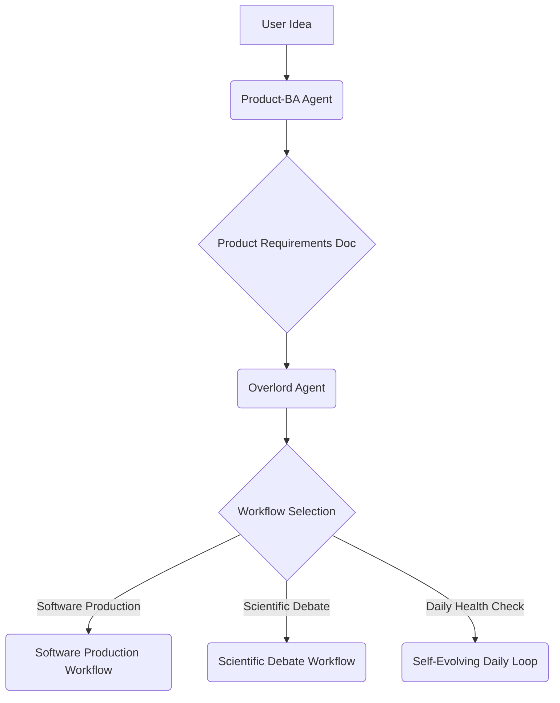

# 🏗️ System Architecture V2: LangGraph Agent System (Survival & Autonomy)

This document outlines the architectural decisions and design patterns used in the **LangGraph Agent System V2**, focusing on high automation, fault-tolerance, and system survival.

---

## 1. High-Level Architecture (UV Workspace Monorepo)

The system is built as a **Monorepo** managed by `uv workspace`. This isolates dependencies preventing "Dependency Hell". 
- `src/`: Contains the core logic, Base Agents, and the "AI Software Factory".
- `projects/`: Contains multiple distinct sub-projects (Trading, Scraping, Content, etc.), each with its own isolated `pyproject.toml`.

## 2. Core Agent Workflow (Meta-Graph)

The main workflow is orchestrated by a "meta-graph" defined in `src/factory/main.py`.

1.  **Product-BA Agent (`product_ba_node`):** Takes a high-level idea and outputs a detailed **Product Requirements Document (PRD)**.
2.  **Overlord Agent (`overlord_graph`):** Receives the PRD. Consults its "Constitution" (which enforces Non-AI Fallbacks) and uses a RAG tool to analyze the codebase. Selects the appropriate sub-workflow.
3.  **Workflow Router:** Routes the state to specialized sub-workflows.

## 3. Sub-Workflows

### a) Software Production Workflow (`software_production.py`)
-   **Planner:** Creates a detailed technical plan.
-   **Coder:** Writes code using AST Modification tools.
-   **Tester:** Runs PyTest and linters.
-   **QA Reviewer:** Reviews the code and provides a score.
-   **Triage Director & Auto-Fixer:** (Middleware / Fallback Node) Kích hoạt khi có lỗi để phân luồng và vá code tự động, không tính là Core Agent độc lập.

### b) The Self-Evolving Daily Loop (`daily_health_loop.py`)
-   A CI/CD meta-graph running nightly to collect telemetry, propose improvements, vet through a Warden (Security), implement via AST Patcher, and benchmark.

### c) Auto Affiliate Video Pipeline (`auto_affiliate_video`)
- **Script & Audio:** LLM generation (`script_generator.py`) and text-to-speech (`tts_engine.py`).
- **Video Assembly:** Pexels API fetching (`broll_fetcher.py`) and MoviePy 2.x editing (`video_editor.py`).
- **Monetization & Upload:** AccessTrade integration (`affiliate_manager.py`) and Auto CI/CD with TikTok's Official REST API (`tiktok_api_uploader.py`).
- **Observability:** Telemetry and latency tracking (`video_telemetry.py`) integrated with the local dashboard.

## 4. System Survival Patterns (The 4 Pillars of V2)

To ensure the system is "immortal" against API failures and logic traps, 4 architectural pillars are strictly enforced:

### Pillar 1: The Circuit Breaker (Application & Network Level)
- **Application Level:** Enforced via `BaseAgent` abstract class. Every agent MUST implement `_ai_handler()` and `_logic_handler()`. If the AI (API) fails or times out, the system automatically falls back to hardcoded logic (e.g., regex, TA-Lib).
- **Network Level (The Bootstrapper's Way):** LLM chains are protected bằng cơ chế 3 lớp: `Tenacity (Exponential Backoff)` + `API Key Round-Robin Pool` (Xoay tua key miễn phí) + `Local Fallback` (Tự động nhảy sang Ollama/Llama-3 nếu toàn bộ Cloud API sập).
- **Quota Level:** `TokenTracker` acts as a Hard Quota Manager, halting the graph via `QuotaExceededError` if session tokens exceed the maximum limit.

### Pillar 2: The Memory Trimmer & Vector RAG
To prevent LangGraph Context Window Explosion during recursive Auto-Fix loops and codebase queries:
- `FactoryState` only stores Pointers (`modified_files`, `error_pointers`).
- Massive log files and tracebacks are written to disk (`logs/tasks/`).
- `MemoryManager` compresses these logs into <100 word summaries for the next LLM generation.
- **Vector RAG Memory:** Agents use `chromadb` to search and extract precise contexts instead of indiscriminately reading massive markdown files.

### Pillar 3: The Ironclad Safeguard (Git Pre-flight Hook)
To prevent "Blind File Operations" and corrupted state locking:
- `GitManager.ensure_clean_state()` is invoked before any Meta-Graph executes.
- It aggressively clears orphaned temp branches (`auto-improve-temp`), unstaged files, and forces a hard reset to `main` if the previous run crashed.

### Pillar 4: AST Code Modification
- Agents modify code strictly using Abstract Syntax Trees (`tools/system/ast_patcher.py`) rather than string manipulation, ensuring syntactic integrity of the generated codebase.

### Pillar 5: Documentation Synchronization
- On-demand CLI tools (`tools/system/sync_docs.py`) ensure that the architecture and roadmap documents remain in sync with the current codebase, reducing Documentation Debt.

---
*For historical context on how we reached V2, refer to [JARVIS_CHRONICLES.md](JARVIS_CHRONICLES.md).*
