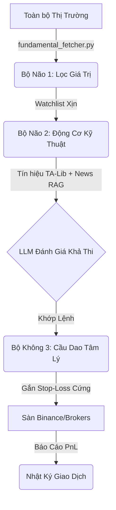

# 📈 THE TRADING AGENT V2: "THE 3-BRAIN ARCHITECTURE"

Tài liệu này mô tả thiết kế lõi của **AI Trading Agent**, được truyền cảm hứng trực tiếp từ các nguyên lý tinh hoa của Benjamin Graham, Steven Achelis, và Tài Chính Hành Vi. Hệ thống được xây dựng để tồn tại qua mọi biến động phi lý của thị trường bằng cách loại bỏ hoàn toàn Cảm Xúc (Emotion) ra khỏi quá trình ra quyết định.

---

## 🧠 1. BỘ NÃO SỐ 1: THE FUNDAMENTAL FILTER (Màng Lọc Giá Trị)
*Lấy cảm hứng từ: Benjamin Graham - Nhà Đầu Tư Thông Minh*

**Mục tiêu:** Phòng thủ. Lọc ra những tài sản rác rưởi (Shitcoins, Penny Stocks) trước khi đưa vào tầm ngắm. Tránh xa sự phi lý trí của "Ngài Thị Trường".

**Luật Kỹ Thuật (Hardcoded Logic):**
- **Quy mô & Thanh khoản:** Khối lượng giao dịch trung bình 30 ngày (Avg Volume 30D) > $50 Triệu.
- **Biên độ An toàn (Margin of Safety):** Giá hiện tại phải thấp hơn ít nhất 20% so với đỉnh gần nhất (ATH). Không bao giờ đu đỉnh các mã "Thời thượng" (Hot Stocks/Coins).
- **Phân tích Cơ bản (Chứng khoán):** `P/E < 15`, `P/B < 1.5`, và Nợ ngắn hạn an toàn (`Current Ratio > 2`).
- *Cơ chế hoạt động:* Module `fundamental_fetcher.py` sẽ tự động tải dữ liệu từ Yahoo Finance/Binance mỗi ngày một lần để tạo danh sách theo dõi (Watchlist).

---

## 📐 2. BỘ NÃO SỐ 2: THE TECHNICAL ENGINE (Động Cơ Giao Dịch)
*Lấy cảm hứng từ: Steven B. Achelis - Phân Tích Kỹ Thuật Từ A Đến Z*

**Mục tiêu:** Tấn công. Tìm điểm Mua/Bán (Entry/Exit) hoàn hảo dựa trên các chỉ báo động lượng đã được thị trường "tiêu hóa" (Market Discounts Everything).

**Luật Kỹ Thuật (TA-Lib Integration):**
- Câu thần chú: *"Trend is your friend"*. Chỉ báo **SMA 50** và **SMA 200** được dùng để xác định Xu hướng Chính (Bull/Bear).
- **Luật Mua (Entry Rules):** 
  - Giá chạm ngưỡng **Hỗ Trợ** (Support Level).
  - Hoặc **RSI (14)** chạm mốc Quá Bán (`Oversold < 30`).
  - Hoặc Giá chạm dải dưới của **Bollinger Bands** kết hợp sự phân kỳ dương của **MACD**.
- *Cơ chế hoạt động:* Module `backtester.py` và `data_fetcher.py` sẽ quét khung giờ (1H, 4H) trên danh sách Watchlist của Bộ Não 1 để bắn Tín hiệu (Signals) cho LLM. AI sẽ đóng vai trò phụ là đọc Tin Tức (News) để củng cố tín hiệu kỹ thuật.

---

## 🛡️ 3. BỘ NÃO SỐ 3: THE BEHAVIORAL WARDEN (Cầu Dao Tâm Lý)
*Lấy cảm hứng từ: Tài Chính Hành Vi (Behavioral Finance)*

**Mục tiêu:** Sinh tồn (Survival). Chống lại những lỗi tư duy nguy hiểm nhất của con người như: Ám ảnh Thua lỗ (Loss Aversion), Tự tin thái quá (Overconfidence) và Tâm lý Bầy đàn (Herd Behavior).

**Luật Kỹ Thuật (The Ironclad Stop-Loss):**
- Đây là một Module Độc Lập bọc ngoài toàn bộ AI. LLM (Gemini/ChatGPT) **không có quyền** can thiệp vào bộ não này.
- **Cấm Gồng Lỗ (No Averaging Down):** Cài đặt Stop-Loss (Cắt lỗ) tự động ngay khi khớp lệnh ở mức `-5%` đến `-8%`. Bán tự động không thương tiếc nếu giá rớt, dù LLM có nhận định là "sắp hồi".
- **Cấm Chốt Lời Non (Let Profits Run):** Sử dụng `Trailing Stop-Loss`. Nếu giá tăng lên 10%, dời chốt chặn lỗ lên mức hòa vốn + 5%. Đảm bảo tuân thủ "Gồng lời lâu, Cắt lỗ sớm".
- **Chống Overtrading (Giao dịch quá mức):** Giới hạn tối đa `X lệnh / tuần`. Nếu thua lỗ liên tiếp 3 lệnh, Cầu Dao Tâm Lý sẽ tự động khóa tài khoản (Cool-down) trong 48h để ngăn hệ thống "trả thù thị trường".

---

## 🚀 TỔNG KẾT KIẾN TRÚC TRADING V2 (Workflow)

Toàn bộ triết lý thiết kế này được bọc lại bởi chuẩn **AI FACTORY V2**, nơi Code Python thuần (Non-AI) đóng vai trò khung xương rèn giũa rủi ro, còn AI chỉ là chất xúc tác để tinh chỉnh quyết định cuối cùng!
