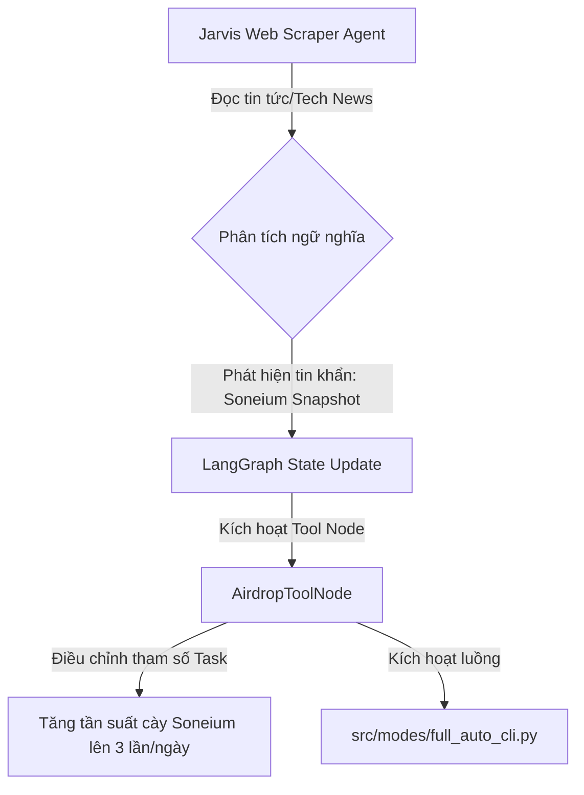

# 🗺️ AIRDROP GUERRILLA - LONG-TERM ARCHITECTURE ROADMAP

*Tài liệu này đóng vai trò là "Source of Truth" (Nguồn sự thật gốc) cho định hướng kiến trúc và lộ trình phát triển của dự án Airdrop Guerrilla.*

---

## 1. Hiệu Đính Hệ Thống Điều Phối & RPC (Phase 1 Upgrade)

### 1.1. Tích hợp Điều phối Tập trung (Centralized Scheduling)

* **Kiến trúc:** Khai tử việc thiết lập Cronjob/Task Scheduler rời rạc trên hệ điều hành. Toàn bộ luồng `full_auto_cli.py` sẽ được đóng gói thành một tác vụ định kỳ (Periodic Task Class) chạy trực tiếp bên trong `scheduler/main_scheduler.py`.
* **Ưu điểm:** Tận dụng tối đa lõi quản lý trạng thái của LangGraph, cho phép giám sát tài nguyên RAM 16GB tập trung. Khi Jarvis đang thực thi các tác vụ train model nặng, nó có quyền hạ mức ưu tiên hoặc tạm hoãn (Pause) tác vụ airdrop để tránh gây tràn bộ nhớ (OOM).

### 1.2. Cơ chế Dynamic RPC Discovery (Bảo trì tự động)

* **Logic:** Xây dựng module `src/networks/rpc_discovery.py` kết nối trực tiếp với Chainlist API.
* **Thuật toán:** Trước mỗi phiên cày ví, module sẽ tự động cào danh sách các node RPC hiện tại của mạng mục tiêu, thực hiện lệnh Ping bất đồng bộ (`httpx`) để đo độ trễ (latency) và kiểm tra chiều cao block. Chọn ra top 3 node tối ưu nhất để nạp trực tiếp vào mảng `rpc_urls` của lớp `EVMBase`.

---

## 2. Chiến Lược Anti-Sybil Hai Lớp Toàn Diện (Phase 2 Detail)

Hệ thống phân tách rạch ròi hai mặt trận phòng thủ để bảo vệ danh sách ví khỏi các thuật toán quét cụm dữ liệu:

### 2.1. Lớp Ngoại Vi - Off-chain Stealth (Luồng `semi_auto_ui`)

* **Mục tiêu:** Vượt qua các bộ lọc biểu mẫu Web (Galxe, Layer3, Inco dApp).
* **Kỹ thuật:** Sử dụng Playwright giả lập vân tay trình duyệt sâu. Giữ cố định cấu hình User-Agent được hash từ địa chỉ ví thông qua `wallet_manager.py`. Triển khai injector để fake các thông số phần cứng bao gồm Canvas fingerprint, WebGL context, và Audio Fingerprint để cô lập hoàn toàn các phiên đăng nhập.

### 2.2. Lớp Lõi Chuỗi - On-chain Stealth (Luồng `full_auto_cli`)

* **Mục tiêu:** Chống các thuật toán phân tích đồ thị liên kết ví (Wallet Clustering Anti-Detection) của NPH.
* **Nguyên tắc cốt lõi:** **Tuyệt đối không có quan hệ dòng tiền chéo.** Cấm hoàn toàn hành vi Ví A gửi phí gas hoặc token nuôi Ví B.
* **Thuật toán nhiễu loạn:** 
  * *Lượng tiền ngẫu nhiên:* Số lượng token gửi hoặc swap phải được lấy ngẫu nhiên bằng hàm `random.uniform()` đến 6 chữ số thập phân.
  * *Thời gian ngẫu nhiên:* Chu kỳ sleep giữa các giao dịch dao động phi tuyến tính từ 5 đến 15 phút, bẻ gãy mọi mô hình phân tích tần suất (Frequency Analysis) của bot kiểm toán.

---

## 3. Kiến Trúc Hội Tụ Hệ Sinh Thái AI (Phase 3 Integration)

### 3.1. Thiết kế Monorepo Tool Node

* Bypass hoàn toàn giải pháp Local API/Socket để triệt tiêu độ trễ. Vì hệ thống nằm chung trong một `uv workspace`, `Airdrop Guerrilla` sẽ được đóng gói thành một lớp `AirdropToolNode` trực tiếp.
* Lớp này kế thừa cấu trúc BaseTool của LangGraph, cho phép các Agent trong hệ thống Jarvis gọi trực tiếp thông qua hàm Python thô.

### 3.2. Đồ thị Phản ứng Động (Dynamic Reactive Graph)

---
*Bản thiết kế được đồng thuận giữa Gemini (Reviewer) và Cline (Architect).*